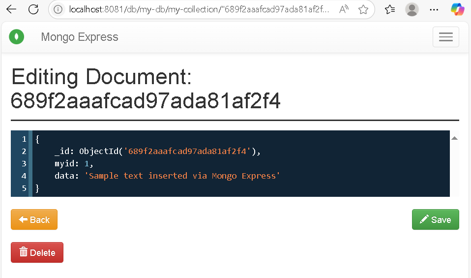

1. **First:** Create a database "my-db", then a collection "my-collection", and store  this data in a document


1. **Second:** It show in App Interface


---

# Mongo Viewer App

> A simple, containerized Node.js + Express application that connects to a MongoDB database and displays a document from `my-db.my-collection` where `myid: 1`.

---

## Table of Contents

- [Overview](#overview)  
- [Architecture](#architecture)  
- [Prerequisites](#prerequisites)  
- [Installation & Setup](#installation--setup)  
- [Usage](#usage)  
- [Environment Variables](#environment-variables)  
- [Project Structure](#project-structure)  
- [Docker Configuration](#docker-configuration)  
- [Contact](#contact)  
- [License](#license)  
---

## Overview

This repository contains a minimal three-tier setup combining:

1. **Backend** – Node.js + Express server  
2. **Database** – MongoDB for persistent data  
3. **Container orchestration** – Docker and Docker Compose for easy setup and deployment

Ideal for learning, demonstration, or as a starting point for larger projects.

---

## Architecture

```plaintext
┌────────────────────┐     HTTP Requests     ┌────────────────────┐     MongoDB Driver     ┌────────────────────┐
│    Frontend*        │ ───────────────────► │      Backend        │ ───────────────────► │     Database        │
│ (Served by my-app)  │                      │ my-app (Node.js +   │                      │ mongodb container   │
│ or API client       │ ◄─────────────────── │ Express, server.js) │ ◄─────────────────── │ (Stores app data)   │
└────────────────────┘     HTTP Responses    └────────────────────┘     Query Results     └────────────────────┘
                                                                                                   │
                                                                                                   │
                                                                                     ┌────────────────────┐
                                                                                     │   Admin Interface   │
                                                                                     │ mongo-express (GUI) │
                                                                                     └────────────────────┘

* If no dedicated UI exists, the backend also acts as the frontend.

```

---

## Prerequisites

Before running the project, ensure you have the following installed on your system:

1. **Docker** – (version X.X or later)
2. **Docker Compose** – (version X.X or later)

You can verify your setup with:

```plaintext
docker --version
docker compose version
```

---

## Installation & Setup

1. **Clone the repository**:
```plaintext
git clone https://github.com/AhmedDev374/mongo-viewer-app.git
cd mongo-viewer-app
```

2. **Copy the environment template (if applicable):**:
```plaintext
cp .env.example .env
```
Then open .env and set your environment variables (DB credentials, ports, etc.).

3. **Start all services using Docker Compose:**:
```plaintext
docker compose up --build
```
This command builds and launches both the app and the MongoDB container.

3. **Access the application:**:
- Frontend: http://localhost:3000 (modify based on your setup)
- Backend API: http://localhost:8081 (mongo-Express)

---

## Usage

- **Web App:** Visit ```http://localhost:3000``` (or whichever port is configured) to view the fetched document.
- **API Endpoint:** Use a browser or API client:
```plaintext
http://localhost:3001/api
```
Customize this path if your application exposes a different endpoint.

---

## Environment Variables

Create a ```.env``` file in the project root:

```plaintext
MONGO_INITDB_ROOT_USERNAME=admin
MONGO_INITDB_ROOT_PASSWORD=securepassword
MONGO_DB_NAME=my-db
BACKEND_PORT=3000
```
Feel free to adjust credentials, ports, and database names as needed.

---

## Project Structure
```plaintext
mongo-viewer-app/
├── app/                   # Node.js + Express application code
│   └── server.js         # Main server script
├── Dockerfile             # Defines container for the backend
├── docker-compose.yml     # Orchestrates backend + MongoDB containers
└── README.md              # Project documentation
```
---

## Docker Configuration

- **Dockerfile:** Builds the Node.js application image.
- **docker-compose.yml:** Defines two services:
  - ```app:``` the backend server
  - ```mongo:``` MongoDB instance with environment vars set via ```.env```
The containers run on the same network, enabling seamless connectivity.

---

## Contact

For questions or feedback, reach out to Ahmed at

1. **LinkDin**: https://eg.linkedin.com/in/ahmed-atef-elnadi-8165a51b9

---

## License

This project is licensed under the **GNU General Public License v3.0**.  
See the full license text here: [LICENSE](LICENSE).
